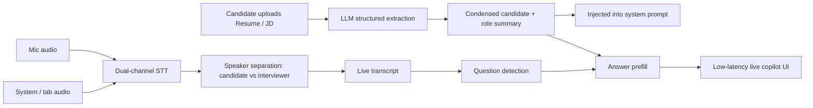
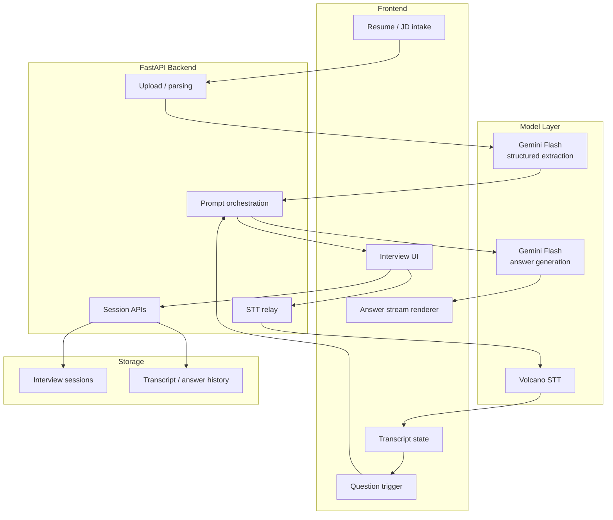

# Interview Copilot

## Demo

- Watch the demo: [Loom walkthrough](https://www.loom.com/share/29f9187f63cf409abcd9816aa23eaefc)
- Download the local video file: [demo/interview-copilot-demo.mp4](./demo/interview-copilot-demo.mp4) `3.2MB`


## Workflow



## Architecture



## What The Demo Does

### 1. Resume + JD grounding

候选人可以上传 `Resume` 和 `JD`。

系统会：

- 解析原始文本 / 文件
- 用 LLM 做结构化抽取
- 生成一段压缩后的候选人 summary 和 role summary
- 把这段 summary 塞进后续回答链路的 system prompt

这一步的目的很直接：

不要让 live answer generation 每一轮都重新“猜”候选人是谁、岗位要什么。

## 2. Live transcript

系统同时接两路音频：

- 候选人麦克风
- 面试官系统音频 / tab 音频

然后做：

- 实时转写
- speaker separation
- transcript streaming

也就是，系统不是只有一段 transcript，而是能持续区分：

- `candidate`
- `interviewer`

这对后面的 trigger 很关键。

## 3. Question detection + prefill

右侧 copilot 不需要等整场 transcript 结束。

当前链路是：

- 左侧 transcript 一边流式更新
- 一边检测 interviewer 当前轮次是否已经形成问题
- 一旦识别到问题信号，就立刻开始生成 answer prefill

核心目标只有一个：

**抢时间。**

不是“完美理解一切再回答”，而是尽可能在 interviewer 说完的同时，把候选人可用的答案提前铺出来，压低感知延迟。

## Current Product Shape

这个 demo 目前已经打通了三件真正难的事：

- candidate / role grounding
- dual-channel real-time transcript
- low-latency answer prefill

所以它不是一个静态 prompt app。

它更接近一个实时 AI system。

## Tech Stack

### Frontend

- React 18
- TypeScript
- Vite
- Tailwind CSS
- shadcn/ui

### Backend

- FastAPI
- async SQLAlchemy
- SQLite for local development

### AI / Speech

- Gemini Flash for structured extraction and answer generation
- Volcano STT for live speech transcription

## Latency Breakdown

当前右侧 latency 主要由这几部分组成：

1. interviewer 的问题被 STT 识别出来
2. 前端做一个很短的 trigger debounce
3. 前端发请求到后端
4. 后端调用 Gemini Flash
5. Gemini 返回首 token
6. 前端流式渲染答案

真正的大头通常不是前端渲染。

真正的大头是：

- STT 什么时候把问题暴露得足够清楚
- LLM 的 time-to-first-token

## What Still Needs Work

这版 demo 是能用的，但还远远没到终局。

下一步最值得继续做的方向：

### Lower latency

- 更小的 prompt
- 更少的 transcript context
- prefill / refine 两阶段回答
- 更 aggressive 的 VAD / finalization 策略

### Better trigger quality

- 不只看问号
- 更强的 interviewer turn parsing
- 区分寒暄、确认句、真实面试问题

### Better answer quality

- behavioral / technical / product / system design 分流
- 更强的 candidate-specific grounding
- 更短、更像真人现场会说的话

## Local Run

### Frontend

```bash
cd frontend
pnpm install
pnpm dev
```

### Backend

```bash
cd backend
python3.13 -m venv .venv
source .venv/bin/activate
pip install -r requirements.txt
uvicorn --env-file .env main:app --host 0.0.0.0 --port 8000
```

### Env

```env
GOOGLE_API_KEY=your-google-ai-studio-key
GEMINI_API_KEY=your-google-ai-studio-key
DATABASE_URL=sqlite+aiosqlite:///./interview_copilot.db
```

## Bottom Line

这不是“面试问答 prompt”。

这是一个把：

- structured candidate context
- dual-speaker live transcript
- question detection
- low-latency answer prefill

拼成一条实时工作流的 demo。

这才是这个项目的核心。
