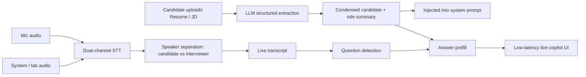
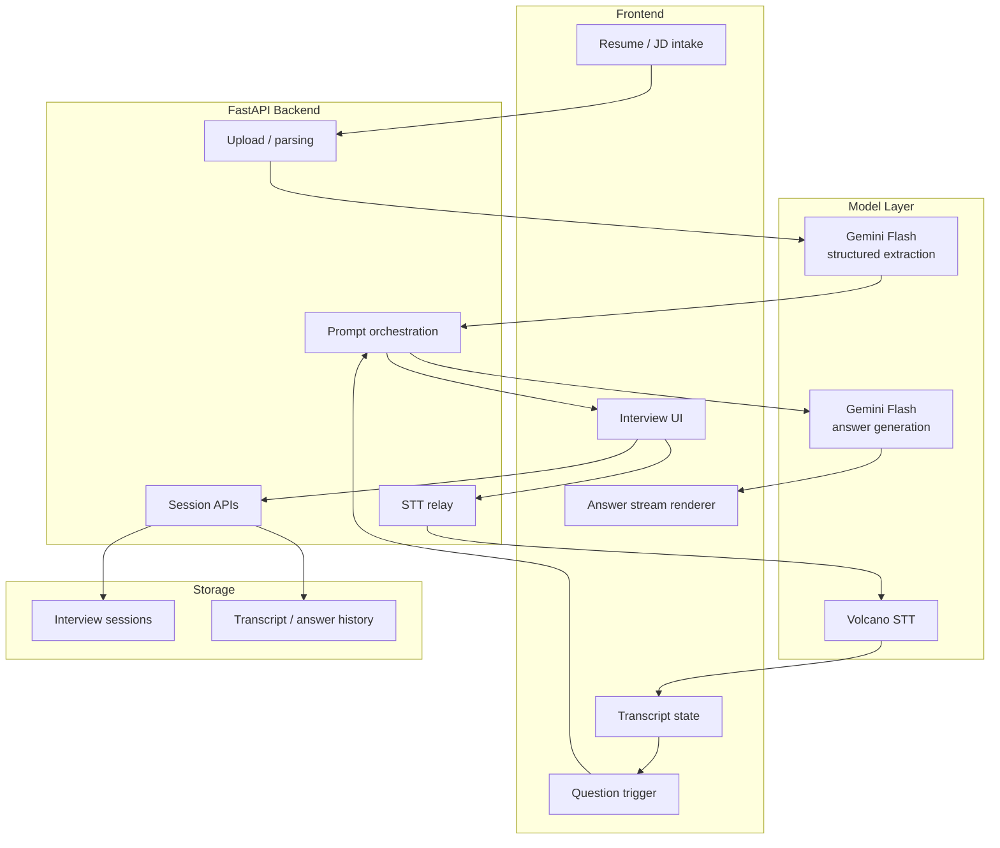

# Interview Copilot

## Demo

- Watch the demo: [Loom walkthrough](https://www.loom.com/share/29f9187f63cf409abcd9816aa23eaefc)
- Download the local video file: [demo/interview-copilot-demo.mp4](./demo/interview-copilot-demo.mp4) `10MB`

A real-time interview copilot.

The point is not "answering questions with an LLM."  
The point is wiring candidate grounding, dual-channel speech, question detection, and low-latency answer prefill into one working system.

## Workflow



## Architecture



## What The Demo Does

### 1. Resume + JD grounding

The candidate can upload a `Resume` and a `JD`.

The system then:

- parses raw text / files
- runs LLM-based structured extraction
- produces a compressed candidate summary and role summary
- injects that summary into the downstream system prompt

This matters because live answer generation should not have to re-derive who the candidate is and what the role needs on every turn.

## 2. Live transcript

The system listens to two audio streams at the same time:

- candidate microphone
- interviewer system audio / tab audio

Then it does:

- real-time transcription
- speaker separation
- streaming transcript updates

That means the app is not dealing with one generic transcript blob. It continuously maintains:

- `candidate`
- `interviewer`

That boundary is what makes the downstream trigger usable.

## 3. Question detection + prefill

The right-side copilot does not wait for the whole transcript to settle.

The current path is:

- the left panel keeps updating live transcript
- the system watches the current interviewer turn for question signals
- once a question is detected, it immediately starts generating an answer prefill

The goal is simple:

**win back time.**

Not "understand everything perfectly before responding," but get a usable answer in front of the candidate as early as possible.

## Current Product Shape

This demo already connects three hard pieces:

- candidate / role grounding
- dual-channel real-time transcript
- low-latency answer prefill

So this is not a static prompt app.

It is much closer to a real-time AI system.

## Tech Stack

### Frontend

- React 18
- TypeScript
- Vite
- Tailwind CSS
- shadcn/ui

### Backend

- FastAPI
- async SQLAlchemy
- SQLite for local development

### AI / Speech

- Gemini Flash for structured extraction and answer generation
- Volcano STT for live speech transcription

## Latency Breakdown

Right-panel latency is mostly made of:

1. the interviewer question becoming visible to STT
2. a very short frontend trigger debounce
3. frontend -> backend request time
4. backend -> Gemini Flash call
5. time-to-first-token from the model
6. streamed completion rendering

In practice, the big buckets are not frontend paint time.

The big buckets are:

- when STT exposes the question clearly enough
- LLM TTFC

## What Still Needs Work

This demo is usable, but not done.

The next obvious improvements are:

### Lower latency

- smaller prompts
- less transcript context
- prefill / refine two-stage generation
- more aggressive VAD / finalization policy

### Better trigger quality

- not just punctuation
- better interviewer-turn parsing
- separate greetings, confirmation phrases, and real interview questions

### Better answer quality

- route behavioral / technical / product / system design questions differently
- stronger candidate-specific grounding
- shorter answers that sound closer to real spoken delivery

## Local Run

### Frontend

```bash
cd frontend
pnpm install
pnpm dev
```

### Backend

```bash
cd backend
python3.13 -m venv .venv
source .venv/bin/activate
pip install -r requirements.txt
uvicorn --env-file .env main:app --host 0.0.0.0 --port 8000
```

### Env

```env
GOOGLE_API_KEY=your-google-ai-studio-key
GEMINI_API_KEY=your-google-ai-studio-key
DATABASE_URL=sqlite+aiosqlite:///./interview_copilot.db
```

## Bottom Line

This is not "an interview prompt."

It is a working demo that combines:

- structured candidate grounding
- dual-speaker live transcript
- question detection
- low-latency answer prefill

into a single real-time workflow.

That is the actual point of the project.
